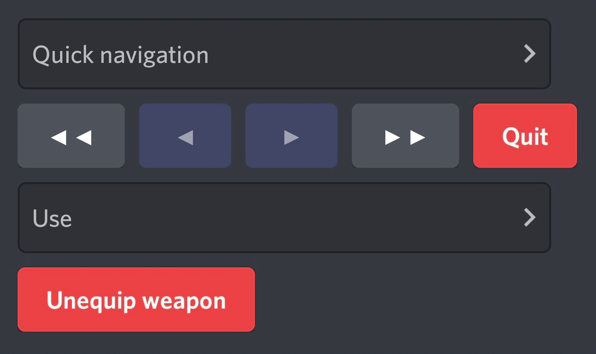

[](https://discord.gg/DFDUpXJNdc)
[](https://github.com/Rapptz/discord.py)
[](https://pypi.python.org/pypi/discord.py)

# discord.py-paginator
Buttons pagination template for discord bots.

# Useage
Install via [pip](https://pypi.org/project/discord.py-paginator/).
```cmd
py -m pip install -U discord.py-paginator

:: for latest/unstable
py -m pip install -U git+https://github.com/Marseel-E/discord.py-paginator
```
### or
Download [this](src/paginator) folder and place it in your project directory. (or clone it with the following command)
```cmd
git clone https://github.com/Marseel-E/discord.py-paginator
```

# Example
```py
import discord
from paginator import Paginator


@discord.app_commands.command()
async def command_name(interaction: discord.Interaction):
    pages = []
    page_content = ""
    
    for i in range(15):
        if (i > 0) and (i % 5 == 0):
            pages.append(page_content)
            page_content = ""

        page_content += f"{i+1}. Item `{i}`\n"

    if (page_content != "") and not (page_content in pages): pages.append(page_content)
        
    await Paginator(interaction, pages).start()
```

# Preview




### :scroll: [LICENSE](LICENSE)
