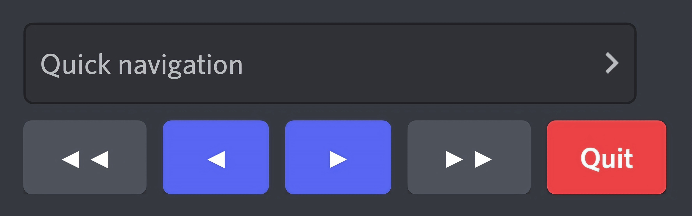

[](https://discord.gg/DFDUpXJNdc)
[](https://github.com/Rapptz/discord.py)
[](https://pypi.python.org/pypi/discord.py)

# discord.py-paginator
Buttons pagination template for discord bots.

# Example
```py
import discord
from paginator import Paginator


@discord.app_commands.command()
async def command_name(interaction: discord.Interaction):
    data = {...}
    pages = []
    page_content = ""

    for i, (key, value) in enumerate(data.items()):
        if (i > 0) and (i + 1 % 5 == 0):
            pages.append(page_content)

            page_content += f"{i+1}. {key.capitalize()} `{value}`\n")

    await Paginator(interaction, pages).start()
```

# Preview



### :scroll: [LICENSE](LICENSE)
